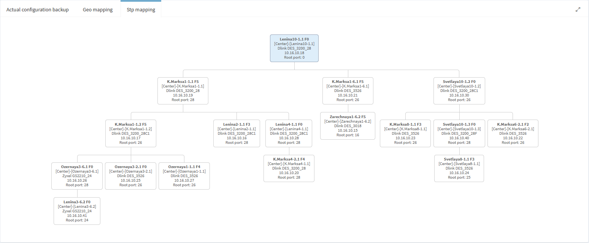

!!! note "Info"
    STP mapping plugin displays spanning tree, related to the particular node. 
    
When plugin is installed, new tab `STP mapping` is being added next to configuration backup tab, as well as new menu item appears.

STP data can be collected from nodes within scheduled task `stp`. The task itself is built-in and doesn't depend on plugin. _The plugin is responsible only for displaying STP tree, not for collecting data from nodes_. Thus task `stp` will remain in the system even if you uninstall the plugin, ensure to handle it in a proper way, removing from schedule if it's unnecessary.

In menu entry `Plugins -> Stp mapping` you can obtain STP tree graphical representation, searching for a node by its `id`, `mac address` or `ip address`. Currently these are only criterias for lookup, so if you need spanning tree by node name, location or any other criteria - use [Nodes interface](../nodes.md)

To collect necessary data with certain periodicity, make sure, that `stp` scheduled task is set up properly. Related logs are located in `Logs -> Scheduler` and can be filtered out by task name `stp`. Please note, that STP realization differs from vendor to vendor, if your device data is not collected properly, contact us to find the solution.
 