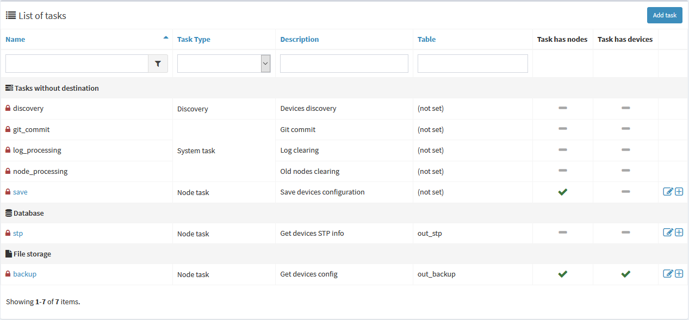
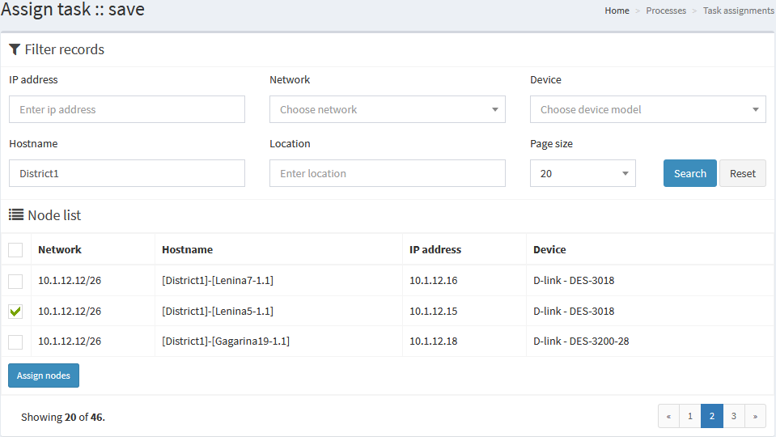
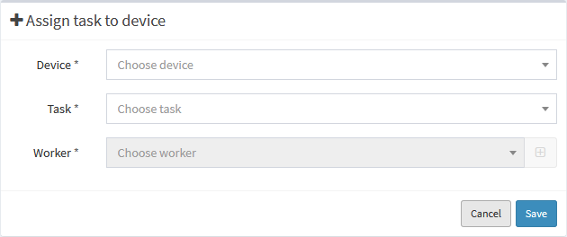
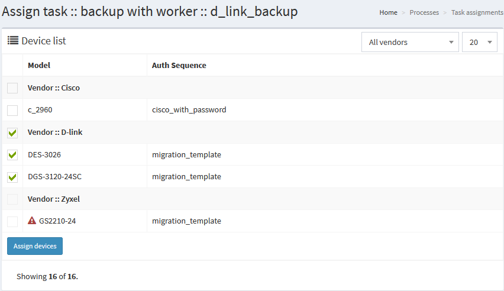

# Tasks

Task is a task (well, thank you, captn). It's a set of workers, that can be scheduled to run with certain periodicity. Tasks are available under `Processes -> Tasks` menu. Note, that some tasks are considered as system tasks and are protected from deletion and some tasks can't be assigned to nodes - only to devices. Here's the table of built-in tasks:

_Task_ | _Protected_ | _Nodes_ | _Devices_ | _Description_
------------ | ------------- | ------------- | ------------- | -------------
backup | yes | yes | yes | Retrieve nodes configuration
discovery | yes | no | no | Discover new and update existing nodes
git_commit | yes | no | yes | Commit obtained configuration to git. In [system settings](system-configuration/#git-settings) git repository for configs must be configured and initialized. Check [corresponding manual](system-configuration/#git-settings) for Git configuration.
log_processing | yes | no | yes | Clear outdated logs. Additionally configured in [system settings](system-configuration/#system-settings) via parameter `Logs lifetime` (7 days by default)
node_processing | yes | no | yes | Clear outdated nodes which were not online for certain time. Additionally configured in [system settings](system-configuration/#system-settings) via parameter `Nodes lifetime` (unlimited by default).
save | yes | yes | yes | Save configuration on nodes, can be useful to additionally secure node from losing unsaved config
stp | yes | yes | yes | Retrieve STP information from nodes

In the task list you can see all available tasks grouped by destination and to check if there're any assignments exist and to edit or assign them as well:
 

# Assign tasks

Task can be assigned under `Processes -> Task Assignments` menu to any node or to the device. Or you can press <i class="fa fa-plus-square"></i> seen on the image above. Note, that tasks _discovery, git_commit, log_processing_ and _node_processing_ are system-wide tasks and can't be assigned to devices nor nodes (there's no <i class="fa fa-plus-square"></i> icon next to them).

There're several assignment modes: [simple assignment to nodes](#simple-nodes), [advanced assignment to nodes](#advanced-nodes), [simple assignment to devices](#simple-devices) and [advanced assignment to devices](#advanced-devices). Difference between assignment to nodes and devices should be clear: in the first case task is assigned to particular nodes, and in the second - to every node under certain [device class](devices).  

## Simple nodes

Simple mode allows to assign task to node in one easy step: choose task, choose _node_, set worker and save. Dropdown select box for hostname or ip-address is searchable. Keep in mind what worker do you want to assign to the chosen node:

## Advanced nodes

Advanced mode is meant to allow assignment in batch mode, processing multiple nodes at once. First you will be promted what task do you want to assign. Next you will be redirected to advanced form where you want to choose all necessary nodes. Mark checkboxes for all nodes you want to assign and press **"Assign nodes"** button below. All nodes that are already assigned will be marked with green <i class="fa fa-check text-success"></i> checkmark you can remove to unassign task from the node:

## Simple devices

Simple mode allows to assign task to node in one easy step: choose task, choose _device_, set worker and save. Keep in mind what worker do you want to assign to the chosen device:

## Advanced devices 

Advanced mode is meant to allow assignment in batch mode, processing multiple devices at once. First you will be promted what task and what do you want to assign. Next you will be redirected to advanced form where you want to choose all necessary devices. Mark checkboxes for all devices you want to assign and press **"Assign devices"** button below. All devices that are already assigned will be marked with green <i class="fa fa-check text-success"></i> checkmark you can remove to unassign task from the device. Also there can be red <i class="fa fa-warning text-danger"></i> icons, showing that this device has already attached to the chosen task but _with different worker_. To read what worker has been assigned, hover mouse pointer onto the icon. 

