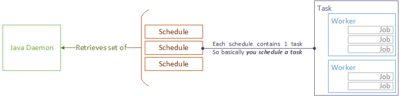

# Концепция

cBackup использует протоколы SNMP, Telnet и SSH для связи с устройствами и для извлечения данных из узлов. SNMP используется для процессов обнаружения и опроса узлов. Резервное копирование узлов возможно только через протокол Telnet или SSH, однако SNMP предоставляет более подробные данные для управления узлами.

Сам cBackup состоит из двух частей: веб-интерфейса и демона. Веб-интерфейс написан на PHP фреймворке [Yii2 framework](http://www.yiiframework.com), а демон - это приложение Java Spring, работающее в качестве системной службы. Демон общается с web-ядром cBackup через REST API по протоколу HTTP.

# Ключевые термины

_Term_ | _Definition_
------------ | -------------
Узел | Сетевое оборудование, объект чья конфигурация подлежит резервному копированию. Чаще всего **узел** это коммутатор или маршрутизатор различных классов.
Устройство | Класс или группа сетевого оборудования с описанием значений производителя и модели устройства. Для каждого устройства назначается **шаблон аутентификации**
Шаблон аутентификации | Последовательность запросов и ответов требуемых для аутентификации на устройстве через Telnet. Каждый шаблон может быть назначен любому **устройству**. Доступны несколько макросов (такие как {{telnet_login}}, {{telnet_password}}) предоставляющих данные из **реквизитов**.  
**⚠ ВНИМАНИЕ!!!**  При коммуникации через SSH все макросы будут игнорироваться и исходные данные будут получены напрямую из **реквизитов**. Остальная часть последовательности, если необходимо будет использоваться для отправки пароля привелигерованного режима. Смотрите в [authentiaction documentation](../administrators-guide/authentication) для подробного изучения.

Подсеть | Простая подсеть любого класса определенного в CIDR формате. Для каждой подсети указываются определенные **реквизиты**. 
Реквизиты | Указанные данные для аутентификации (имена пользователей, пароли, протоколы, номера портов и т.д), которые используются в процессе аутентификации. Реквизиты могут быть назначены любому количеству подсетей и использоваться в многочисленных процессах cBackup.
Обнаружение | Процесс проверки узлов во всех указанных подсетях. Обнаруживаются новые узлы, а существующие проверяются на наличие изменений (например, если модель устройства была изменена).
Демон | Главный демон cBackup с внутренним планировщиком заданий - это исполняемый файл .JAR. Он управляет процессами обнаружения, опроса и получения необходимых данных конфигурации. Общается с web-ядром cBackup через REST API.
Расписание | cBackup использует собственный планировщик заданий и не зависит от системного планироващика cron. Вы можете запланировать системные задачи и настроить отправку отчетов через электронную почту. Каждое запланированное событие = одной задаче.
Task | Particular task itself that could be assigned to nodes or devices. Task consists of **workers**.
Worker | Set of commands intended for specific functionality processing. Primarily worker is described by protocol and consists of **jobs' sequence**
Job | Specific command (Telnet or SSH depending on **worker's** protocol). Also can be SNMP OID if worker, which contains this job works over SNMP protocol. 

# Process components

For process components relations comprehension the following diagram can be used:

